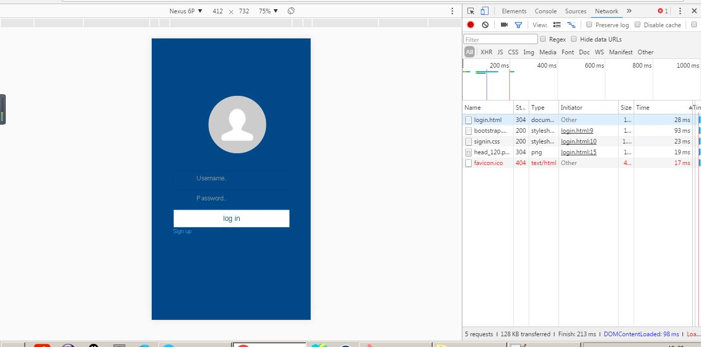

# BootstrapDemo
基于bootstrap开发的登陆注册和上传图片，前端上传用了bootstrap的fileinput插件，后台是php写的，sql文件也有。

关于这个fileinput插件有很多要吐槽的，多文件并不是一起上传的，而是一个一个的上传，上传的时候，服务器必须返回json字符串回来，而且返回的时候必须是服务器代码中的最后一行

之前是为了前台及时显示，我就先返回前台上传成功，再去做数据库处理操作，发现不行，把数据库操作做完插入成功后，然后返回json数据回去就行了，而且返回成功json数据给前台，这个插件又不去显示我成功返回的处理，也是蛋疼的插件，无力吐槽

